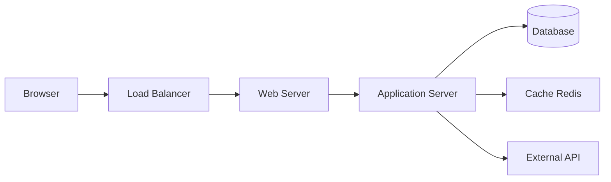
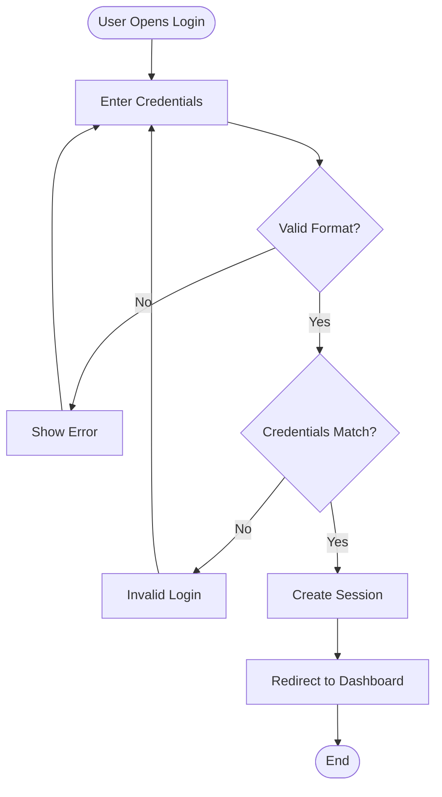
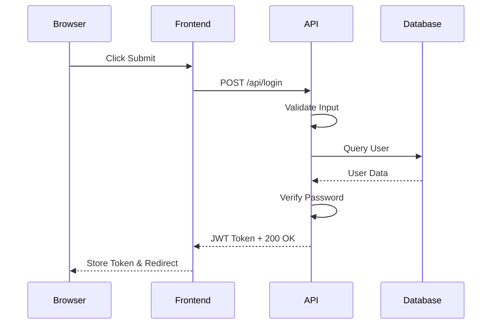

# Mermaid Diagrams

## 1. Block Diagram for Web App

```mermaid
graph LR
    A[Browser] --> B[Load Balancer]
    B --> C[Web Server]
    C --> D[Application Server]
    D --> E[(Database)]
    D --> F[Cache Redis]
    D --> G[External API]
    
```

---
---

## 2. Flowchart for Login Process

```mermaid
flowchart TD
    Start([User Opens Login]) --> Input[Enter Credentials]
    Input --> Validate{Valid Format?}
    Validate -->|No| Error1[Show Error]
    Error1 --> Input
    Validate -->|Yes| Check{Credentials Match?}
    Check -->|No| Error2[Invalid Login]
    Error2 --> Input
    Check -->|Yes| Session[Create Session]
    Session --> Redirect[Redirect to Dashboard]
    Redirect --> End([End])

```

---
---

## 3. Sequence Diagram for API Request

```mermaid
sequenceDiagram
    participant Browser
    participant Frontend
    participant API
    participant Database
    
    Browser->>Frontend: Click Submit
    Frontend->>API: POST /api/login
    API->>API: Validate Input
    API->>Database: Query User
    Database-->>API: User Data
    API->>API: Verify Password
    API-->>Frontend: JWT Token + 200 OK
    Frontend-->>Browser: Store Token & Redirect

```
