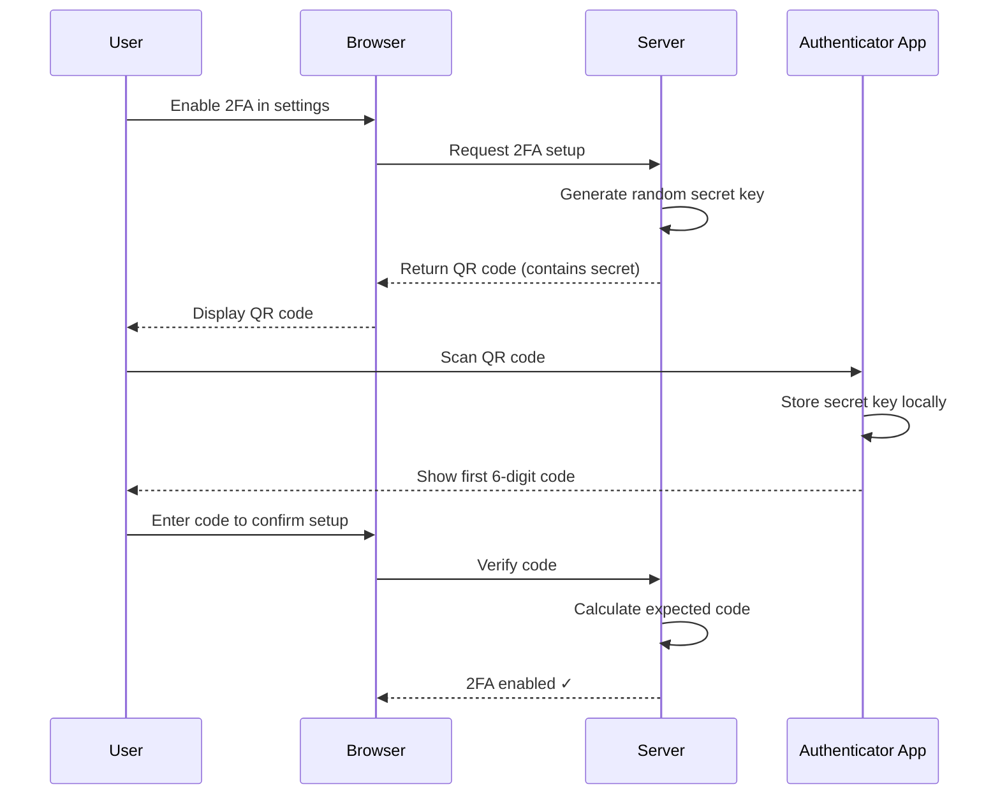
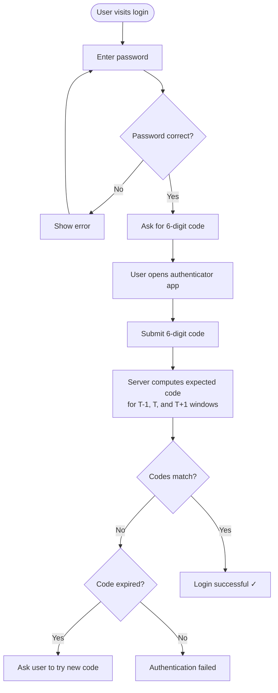

# How TOTP Actually Works (RFC 6238)

**By:** Kartikey Kumar  
**Date:** February 2026

---

## Why This Matters

If you've ever logged in somewhere and entered:

1. Your password
2. A 6-digit code from an authenticator app

— you've used **TOTP**.

Apps like Google Authenticator generate those 6-digit codes. They refresh every 30 seconds. No SMS. No server ping. No network request.

And the wild part?

Your phone and the server both calculate the *exact same number* at the same time — without talking to each other.

That's what we're going to break down properly.

Not just "how to use it."  
But how the math works under the hood.

---

## The Core Idea (One Sentence Version)

> The server and your phone share one secret key, and both independently compute  
> `HMAC(secret_key, current_time_window)`

Time + Secret → Same code.

That's it.

---

## Why Passwords Alone Are Weak

A password is something you *know*.

If it gets leaked — phishing, database breach, keylogger — the attacker can log in from anywhere, forever. There's nothing stopping them.

TOTP fixes that by adding something you *have* — your phone.

Even if someone steals your password, they still need:

- Your physical device
- At that exact 30-second window

That's a huge security upgrade.

---

## Why Not Just Use SMS?

SMS codes travel over the telecom network. And that network can be attacked:

- SIM swapping
- SMS interception
- Social engineering at the carrier level

TOTP avoids that completely. After setup, no codes are transmitted, no messages are sent — everything is calculated locally using cryptography.

That's why serious systems prefer TOTP.

---

## The Official Standard

TOTP is defined in **RFC 6238**.

RFCs (Request for Comments) are how internet standards are documented. Because this is standardized, a code from Google Authenticator works with any compliant backend. Your implementation will interoperate globally.

---

# Let's Build It From First Principles

Before TOTP, there are two building blocks you must understand.

---

## 1. Hash Functions

A hash function:

- Takes any input
- Produces fixed-size output
- Is **deterministic** (same input → same output, always)
- Cannot be reversed

Example using SHA-1:

```
SHA1("hello") → aaf4c61ddcc5e8a2dabede0f3b482cd9aea9434d
SHA1("Hello") → f7ff9e8b7bb2e09b70935a5d785e0cc5d9d0abf0
```

One character change. Completely different output.

This is called the **avalanche effect**.

But SHA alone is not enough for TOTP.

---

## 2. HMAC — Hash With a Secret Key

Regular hash:

```
SHA1(message)              → anyone can compute this
```

HMAC:

```
HMAC-SHA1(secret, message) → only someone with the key can compute this
```

That's the security backbone of TOTP.

If we hashed only the current time, everyone on Earth could generate the same code. Adding the secret makes it private — only your phone and the server can produce the right output.

---

# Now Let's Build TOTP

## Step 1 — Turn Time Into a Counter

Instead of using raw Unix time (changes every second), we divide it by 30.

```
T = floor(current_unix_time / 30)
```

Example:

```
Unix time:  1708956000
T = floor(1708956000 / 30) = 56965200
```

That value (56965200) stays constant for the full 30-second window:

```
10:30:00 → 10:30:29 AM   →   T = 56965200   (same code)
10:30:30 AM              →   T = 56965201   (new code!)
```

That's why your code doesn't flicker every second. It only changes when the window changes.

---

## Step 2 — Run HMAC-SHA1

Compute:

```
HMAC-SHA1(secret_key, T)
```

Output: **20 bytes** (160 bits) of raw data.

We don't use all 20 bytes directly. We extract 4 specific bytes using a trick called **dynamic truncation**.

---

# Real Example — Full Walk-Through

Using official test values from RFC 4226 (the spec TOTP is built on):

```
Secret:    "12345678901234567890"
Unix time: 59
T:         floor(59 / 30) = 1
```

HMAC-SHA1 produces 20 bytes, shown with their index:

```
Index:  00  01  02  03  04  05  06  07  08  09  10  11  12  13  14  15  16  17  18  19
Hex:    75  a4  8a  19  d4  cb  e1  00  64  4e  8a  c1  39  7e  ea  74  7a  2d  33  ab
```

Now we extract a 6-digit code from these 20 bytes in four steps.

---

### Step A — Find the Offset

Take the **last byte** (index 19) and mask it with `0x0F`:

```
Last byte:   0xab  =  1010 1011

  1010 1011   (0xab)
& 0000 1111   (0x0F mask)
────────────
  0000 1011   =  11 decimal

Offset = 11
```

**Why mask with `0x0F`?**

We need a safe starting index. We're about to extract 4 consecutive bytes, so the furthest we can safely start is index 16 (bytes 16, 17, 18, 19 just barely fit). `0x0F` caps the result at 15, which is always safe. No out-of-bounds reads possible.

---

### Step B — Extract 4 Bytes

Starting at index 11, take the next 4 bytes:

```
Index:  11    12    13    14
Hex:    c1    39    7e    ea
```

---

### Step C — Combine Into a 32-bit Integer

We need to turn 4 separate bytes into one single number. We do this with **bit shifting**.

Think of a 32-bit integer as 4 lanes of 8 bits each:

```
[ byte A ][ byte B ][ byte C ][ byte D ]
  bits       bits     bits      bits
  24–31     16–23    8–15      0–7
```

First, zero out the highest bit of byte A (index 11) using `& 0x7F`. This forces a positive number regardless of the language:

```
0xc1  =  1100 0001
& 0x7F =  0111 1111
─────────────────
          0100 0001  =  0x41
```

Now shift each byte into its lane and OR them together:

```
0x41 << 24  =  0x41000000  =  1,090,519,040
0x39 << 16  =  0x00390000  =      3,735,552
0x7e << 8   =  0x00007e00  =         32,256
0xea << 0   =  0x000000ea  =            234
                            ───────────────
Combined    =  0x41397eea  =  1,094,287,082
```

Visualized as bits — each byte slots into its own 8-bit position, no overlap:

```
0x41000000  =  0100 0001  0000 0000  0000 0000  0000 0000
0x00390000  =  0000 0000  0011 1001  0000 0000  0000 0000
0x00007e00  =  0000 0000  0000 0000  0111 1110  0000 0000
0x000000ea  =  0000 0000  0000 0000  0000 0000  1110 1010
             ──────────────────────────────────────────
Result      =  0100 0001  0011 1001  0111 1110  1110 1010
```

---

### Step D — Reduce to 6 Digits

```
1,094,287,082 % 1,000,000 = 287,082
```

**Final code: `287082`** ✓

This matches the official RFC test vector exactly.

---

### Full Algorithm at a Glance

```
Step 1:  Unix time = 59
         T = floor(59 / 30) = 1

Step 2:  HMAC-SHA1(secret, T)
         → 75 a4 8a 19 d4 cb e1 00 64 4e 8a c1 39 7e ea 74 7a 2d 33 ab

Step 3:  Offset = last byte & 0x0F
         0xab & 0x0F = 11

Step 4:  Extract bytes at index 11, 12, 13, 14
         → c1  39  7e  ea

Step 5:  Mask first byte: 0xc1 & 0x7F = 0x41
         Bit shift + OR:
         (0x41 << 24) | (0x39 << 16) | (0x7e << 8) | 0xea = 1,094,287,082

Step 6:  1,094,287,082 % 1,000,000 = 287,082

Result:  287082
```

---

# Setup Flow (QR Code Scanning)

When a user enables 2FA for the first time:



The QR code encodes a URI like this:

```
otpauth://totp/MyApp:user@example.com?
  secret=JBSWY3DPEHPK3PXP
  &issuer=MyApp
  &algorithm=SHA1
  &digits=6
  &period=30
```

Key things here:

- `secret` is the shared key, Base32 encoded
- After setup, it is **never transmitted again**
- `period=30` tells the app to use 30-second windows

From that point on, both sides compute codes independently.

---

# Login Flow



---

## Why the Server Checks Multiple Windows

Clocks are not perfect. Network delays happen. The server checks three adjacent windows to compensate:

```
Server time: 10:30:25 AM

Window T-1  →  10:30:00–10:30:29  (previous)
Window T    →  10:30:30–10:30:59  (current)
Window T+1  →  10:31:00–10:31:29  (next)
```

This gives roughly a 90-second acceptance range without weakening security much.

Checking too many windows is a problem. A wider window means a stolen code stays valid longer. The RFC recommends ±1 as the default.

Balance matters.

---

# Security Properties

| Property | Why It Matters |
|---|---|
| Time-limited | Code expires every 30 seconds |
| Offline | No network dependency after setup |
| Secret-based | Impossible to compute without the key |
| Phishing-resistant | Intercepted code is useless within seconds |
| Standardized (RFC 6238) | Works across all apps and platforms |
| Brute-force resistant | 1M combinations + rate limiting = secure endpoint |

**Important system design note:**  
Always rate-limit your TOTP verification endpoint.

Without rate limiting, 1,000,000 combinations is brute-forceable in minutes.

---

# What You Should Remember

If asked in an interview:

> "How does TOTP work internally?"

You say:

- It uses a shared secret, exchanged once via QR code
- Converts current Unix time into a 30-second window counter `T`
- Runs `HMAC-SHA1(secret, T)` → 20-byte output
- Uses the last byte to pick a dynamic offset (0–15)
- Extracts 4 bytes at that offset
- Combines them into a 31-bit integer via bit shifting
- Takes modulo 10⁶ → 6-digit code
- Server checks ±1 adjacent windows to handle clock drift

That answer shows real understanding.

---

# What Comes Next

- Study **HOTP** (counter-based OTP) — what TOTP is built on
- Implement **backup codes** for when users lose their phone
- Add proper **rate limiting** on the verification endpoint
- Explore **WebAuthn / passkeys** — the next evolution

TOTP is strong.

But it's still a shared-secret model. Both sides store the key. If the server is breached, secrets leak.

Passkeys eliminate shared secrets entirely.

That's the next evolution.

---